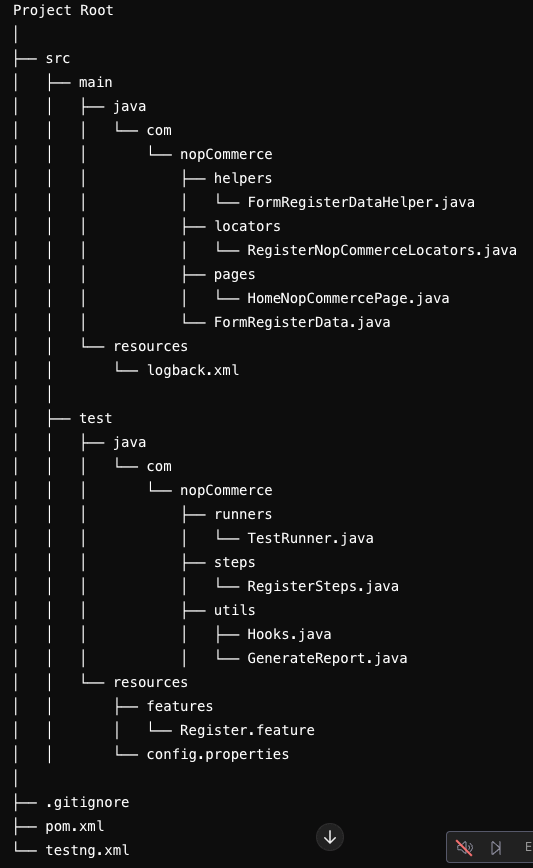

# *Selenium4, WEB project 2024 - 2025*

## Stack: 
- Selenium4
- Cucumber BDD
- TestNG
- slf4j
- Maven
- Webdrivermanager

## *Structure*



# *TODO*
- [ ]  Reporting ExtentReports, Allure or Cucumber
- [ ]  Logging Log4j o SLF4J
- [ ]  CI/CD Jenkins, GitLab CI, CircleCI
- [ ]  Tagging to run specific test or suite

## Directory Details

### `src/main/java/com/nopCommerce/locators`

- **HomeNopCommerceLocators.java**: Contains locators for the Home page elements.

### `src/main/java/com/nopCommerce/pages`

- **BasePage.java**: A base page class that other page classes extend.
- **HomeNopCommercePage.java**: Contains methods to interact with the Home page.

### `src/test/java/com/nopCommerce/steps`

- **LoginSteps.java**: Step definitions for the login feature.

### `src/test/java/com/nopCommerce/utils`

- **Hooks.java**: Contains setup and teardown methods for the tests.

### `src/test/java/com/nopCommerce/runners`

- **TestRunner.java**: Configures and runs the Cucumber tests with TestNG.

### `src/test/resources/features`

- **login.feature**: Contains the Cucumber feature file for login tests.

## Usage

### Prerequisites

- Java JDK
- Maven
- ChromeDriver (managed by WebDriverManager)
- An IDE like IntelliJ IDEA or Eclipse

### Running the Tests

1. Clone the repository.
2. Navigate to the project directory.
3. Run the following Maven command to execute the tests:

```bash
mvn test
```